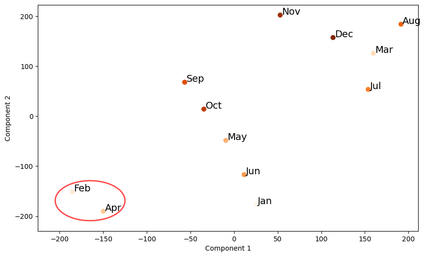

# Embeddings-for-Block-Time-Prediction

This repository contains the implementation code for the embeddings and neural network architectures described in our research paper: Embedding-Based Representation Learning for Building Data-Driven Flight Schedules. It includes scripts for five different architectures, alongside the t-SNE projections of our most successful runs.

## Structure

- `Code/`: Contains the implementation scripts for the neural network architectures.
- `Embeddings_tns_plots/`: Features the t-SNE projections visualizing the embeddings from the best performing model.

## Getting Started

To replicate our results or to use these models in your own project, follow the steps below:

1. Clone this repository: 'git clone https://github.com/criticalml-uw/Embeddings-for-Block-Time-Prediction.git'
2. Install the required dependencies (assuming you have Python installed): 'pip install -r requirements.txt'
3. Run the desired script from the `Code/` directory: 'python code/script_name.py'

## Embeddings from best run

 
*Figure 1: t-SNE Projection of the Months, highlighting clustering patterns.*
